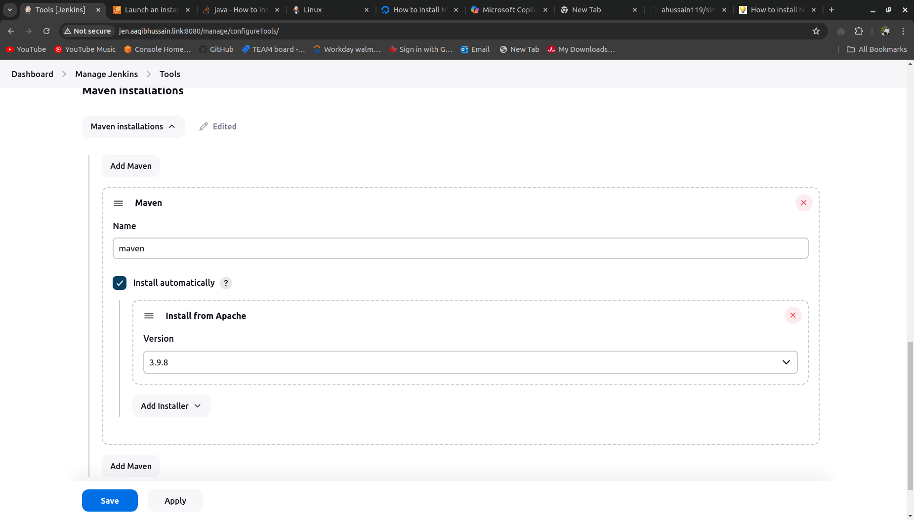
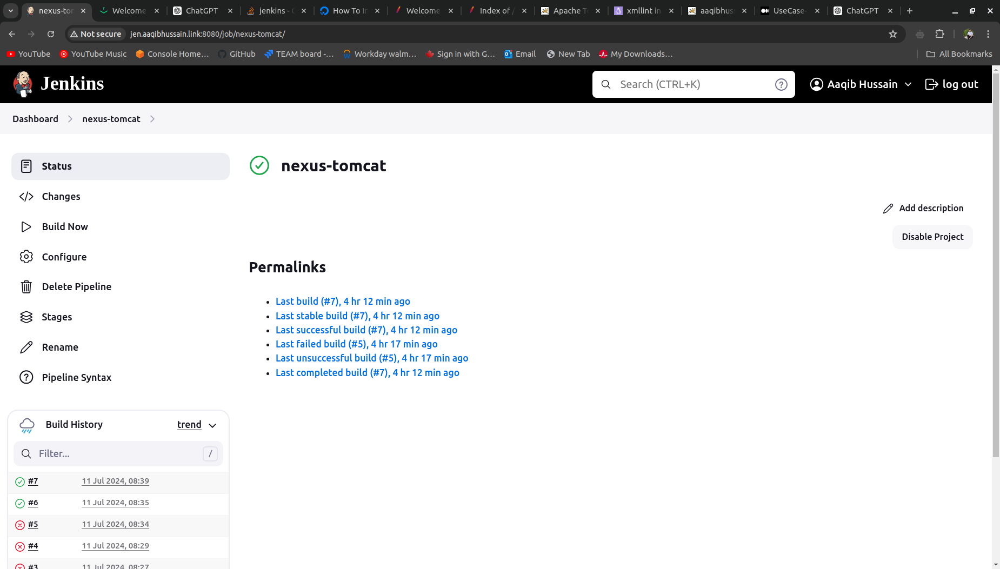

# Build and Store on Nexus Repository, then Deploy on Tomcat

Today, we are building a web Java app and uploading it to the Nexus Artifact Repository using a Jenkins pipeline. Then, we deploy the latest build to Tomcat using a separate pipeline.

## Prerequisites

Before proceeding, ensure you have the following prerequisites:

1. An AWS account with sufficient credits.
2. An SSH key created and downloaded on your AWS account.
3. A domain name and hosted zones set up.

## Provisioning Infrastructure using Terraform

To provision the infrastructure, follow these steps:

1. Download the Terraform configuration from GitHub.
2. Edit the variables, such as the key name and domain name.
3. Run `terraform init`.
4. Run `terraform validate`.
5. Run `terraform plan`.
6. Run `terraform apply`.
7. Verify that you have four instances in a public subnet.

## Setting up Jenkins on your System

To set up Jenkins EC2, follow these steps:

1. SSH in to jenkins EC2, Download and install Java 11:
    ```shell
    sudo apt update
    sudo apt install openjdk-11-jdk
    ```

2. Download Jenkins from the official website and add the Jenkins repository key:
    ```shell
    sudo wget -O /usr/share/keyrings/jenkins-keyring.asc https://pkg.jenkins.io/debian-stable/jenkins.io-2023.key
    echo "deb [signed-by=/usr/share/keyrings/jenkins-keyring.asc] https://pkg.jenkins.io/debian-stable binary/" | sudo tee /etc/apt/sources.list.d/jenkins.list > /dev/null
    sudo apt-get update
    ```

3. Install Jenkins:
    ```shell
    sudo apt-get install jenkins
    ```

4. Retrieve the initial admin password:
    ```shell
    sudo cat /var/lib/jenkins/secrets/initialAdminPassword
    ```


5. Install the suggested plugins to enhance the functionality of Jenkins.

6. Create an admin user to manage Jenkins.


## Maven Setup on EC2 and Configuring on Jenkins

To set up Maven on the EC2 instance and configure it in Jenkins, follow these steps:

1. SSH into the Maven EC2 server.

2. Install Java 11, Maven, XML tools, and Git:
    ```shell
    sudo apt update
    sudo apt install openjdk-11-jdk maven git libxml2-utils
    ```

3. Configure the default Java as Java 11:
    ```shell
    sudo update-alternatives --config java
    ```
    Select Java 11.

4. Add the EC2 instance as a slave to Jenkins:
    - Go to the Jenkins portal.
    - Navigate to "Manage Jenkins" -> "Credentials" -> "Global (domain)" -> "Add credentials".

    - Select "SSH Username with private key" as the kind.
    - Set the ID as "ssh-key".
    - Set the username as "ubuntu".
    - Select "Enter directly" and paste the SSH key.

5. Add the tools that are being used on the agent to Jenkins tools:
    - Go to the Jenkins portal.
    - Navigate to "Manage Jenkins" -> "Global Tool Configuration".


    - Add Git and Maven.

6. Add a new node in Jenkins:
    - Go to "Manage Jenkins" -> "Manage Nodes and Clouds" -> "New Node".
    - Set the name as "maven".
    - Select "Permanent Agent".
    - Set the remote root directory as "/home/ubuntu".
    - Set the label as "maven".
    - Choose "Launch agent via SSH" as the launch method.
    - Set the host as "maven.URL".
    - Select the "ubuntu" credentials.
    - Set the host key verification strategy as "Non verification strategy".
    - Set the home location for Git and Maven.

    - Save the configuration.

7. In the "Nodes" section, select the "maven" node and check the logs to ensure that the agent successfully connects and goes online.

## Nexus Setup on EC2 and Configuring on Jenkins

To set up Nexus on the EC2 instance and configure it in Jenkins, follow these steps:

1. SSH into the Nexus EC2 server.

2. Install Java 11:
    ```shell
    sudo apt update
    sudo apt install openjdk-11-jdk
    ```

3. Create the nexus user:
    ```shell
    sudo useradd -d /opt/nexus -s /bin/false nexus
    sudo passwd nexus
    ```

4. Set the ulimit to '65536' and make the change permanent:
    ```shell
    ulimit -n 65536
    sudo nano /etc/security/limits.d/nexus.conf
    ```
    Add the following line:
    ```shell
    nexus - nofile 65536
    ```
    Verify with:
    ```shell
    ulimit -a
    ```

5. Download Nexus using wget and extract it:
    ```shell
    wget https://download.sonatype.com/nexus/3/nexus-3.70.1-02-java11-unix.tar.gz
    tar xzf nexus*
    ```

6. Move the directories to /opt:
    ```shell
    sudo mkdir /opt
    sudo mv nexus* /opt/nexus
    sudo mv sonatype-work /opt/
    ```

7. Change the user for Nexus:
    ```shell
    chown -R nexus:nexus /opt/nexus /opt/sonatype-work
    sudo nano /opt/nexus/bin/nexus.rc
    ```
    Replace `run_as_user="nexus"`. Exit and save.

8. Running Nexus as a SystemD Service:
    ```shell
    sudo nano /etc/systemd/system/nexus.service
    ```
    Add the following:
    ```shell
    [Unit]
    Description=nexus service
    After=network.target

    [Service]
    Type=forking
    LimitNOFILE=65536
    ExecStart=/opt/nexus/bin/nexus start
    ExecStop=/opt/nexus/bin/nexus stop
    User=nexus
    Restart=on-abort

    [Install]
    WantedBy=multi-user.target
    ```
    Save the file and exit the editor.

9. Reload the systemd manager and start Nexus:
    ```shell
    sudo systemctl daemon-reload
    sudo systemctl start nexus.service
    sudo systemctl enable nexus.service
    sudo systemctl status nexus.service
    ```

10. Go to `URL:8081` and select login.
    User: admin
    The password is in `/opt/sonatype-work/nexus3/admin.password`.
    ```shell
    sudo cat /opt/sonatype-work/nexus3/admin.password
    ```
    Create a new password and "Disable anonymous access". Finish.

11. Select Settings -> Repositories -> Create new Repository -> Maven2 (hosted).

12. Enter the configuration and create the repository "web-java".


13. Add the Nexus EC2 as a slave to Jenkins.

14. Download the plugins Pipeline Utility Steps and Nexus Artifact Uploader:
    - Dashboard -> Manage Jenkins -> Plugins -> Available Plugins -> search for "Pipeline Utility Steps" and "Nexus Artifact Uploader". Install these plugins.

## Set up Tomcat and Configure Jenkins

To set up Tomcat on the EC2 instance and configure it in Jenkins, follow these steps:

1. SSH into the Tomcat EC2 instance.

2. Install Java 11:
    ```shell
    sudo apt update
    sudo apt install openjdk-11-jdk
    ```

3. Create a user for Tomcat:
    ```shell
    sudo useradd -d /opt/tomcat -s /bin/false tomcat
    ```

4. Download Tomcat:
    ```shell
    wget https://downloads.apache.org/tomcat/tomcat-10/v10.1.25/bin/apache-tomcat-10.1.25.tar.gz
    ```

5. Extract the tar file:
    ```shell
    sudo tar xzvf apache-tomcat-10*tar.gz -C /opt/tomcat --strip-components=1
    ```

6. Set Tomcat as the owner of the Tomcat directory:
    ```shell
    sudo chown -R tomcat:tomcat /opt/tomcat/
    sudo chmod -R u+x /opt/tomcat/bin
    ```

7. Configure users:
    ```shell
    sudo nano /opt/tomcat/conf/tomcat-users.xml
    ```
    Add the following lines:
    ```xml
    <role rolename="manager-gui" />
    <user username="manager" password="manager_password" roles="manager-gui, manager-script" />

    <role rolename="admin-gui" />
    <user username="admin" password="admin_password" roles="manager-gui,admin-gui" />
    ```

8. Allow remote login:
    ```shell
    sudo nano /opt/tomcat/webapps/manager/META-INF/context.xml
    sudo nano /opt/tomcat/webapps/host-manager/META-INF/context.xml
    ```
    Comment out the following line in both files:
    ```xml
    <!--  <Valve className="org.apache.catalina.valves.RemoteAddrValve"
         allow="127\.\d+\.\d+\.\d+|::1|0:0:0:0:0:0:0:1" /> -->
    ```

9. Create a systemd service for Tomcat:
    ```shell
    sudo nano /etc/systemd/system/tomcat.service
    ```
    Add the following content:
    ```
    [Unit]
    Description=Tomcat
    After=network.target

    [Service]
    Type=forking

    User=tomcat
    Group=tomcat

    Environment="JAVA_HOME=/usr/lib/jvm/java-1.11.0-openjdk-amd64"
    Environment="JAVA_OPTS=-Djava.security.egd=file:///dev/urandom"
    Environment="CATALINA_BASE=/opt/tomcat"
    Environment="CATALINA_HOME=/opt/tomcat"
    Environment="CATALINA_PID=/opt/tomcat/temp/tomcat.pid"
    Environment="CATALINA_OPTS=-Xms512M -Xmx1024M -server -XX:+UseParallelGC"

    ExecStart=/opt/tomcat/bin/startup.sh
    ExecStop=/opt/tomcat/bin/shutdown.sh

    RestartSec=10
    Restart=always

    [Install]
    WantedBy=multi-user.target
    ```

10. Reload the daemon and start Tomcat:
    ```Shell
    sudo systemctl daemon-reload
    sudo systemctl start tomcat
    sudo systemctl enable tomcat
    ```

11. Access Tomcat at `URL:8080`.


12. Add the Tomcat EC2 instance as a slave to Jenkins.

## Pipeline-1 from Github to Nexus
Now, on the Jenkins dashboard, follow these steps:

1. Click on "New Item".
2. Set the name as "git-nexus".
3. Select "Pipeline".
4. Copy and paste the pipeline script, from git-nexus.
5. Save the configuration.


Finally, Build the pipeline. Tha application will be build and stored on Nexus.


## Pipeline-2 from Nexus to tomcat
This pipeline will download the latest build from nexus and deploy on tomcat

1. Click on "New Item".
2. Set the name as "nexus-tomcat".
3. Select "Pipeline".
4. Copy and paste the pipeline script, from nexus-tomcat.
5. Save the configuration.


Finally, Build the pipeline. Tha application will be build and stored on Nexus.
